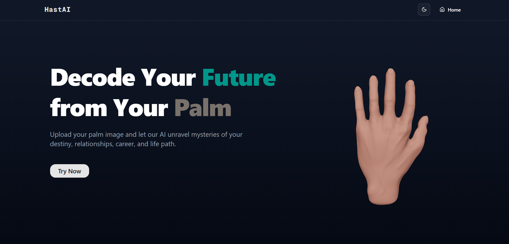
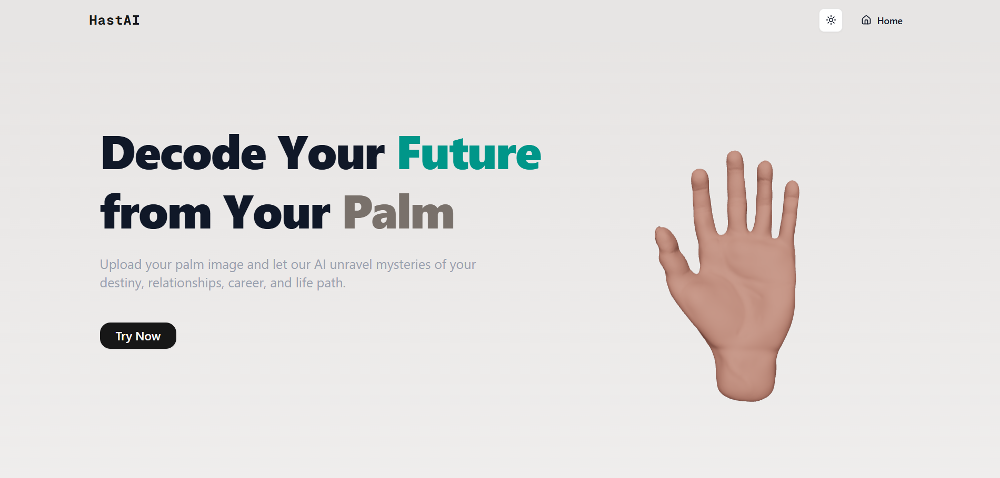
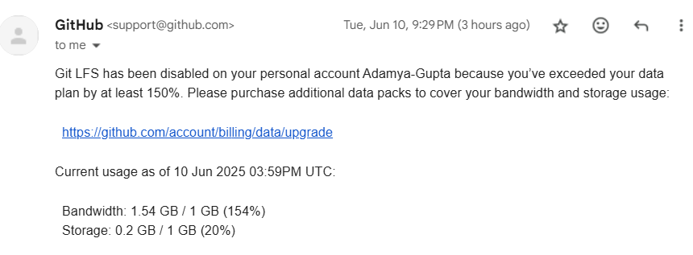
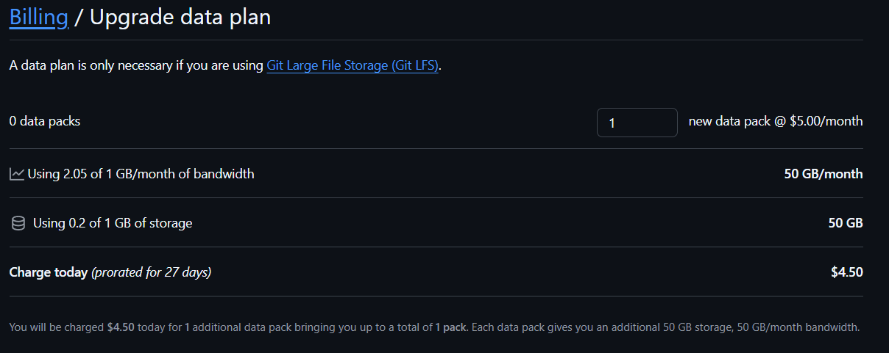

# HastAI - Palm Reader
[](https://choosealicense.com/licenses/mit/)
[](https://git-lfs.com/)

## 🔍 Overview:
HastAI provides free palm reading to users who want to quickly check what their palm reveals, without the need to visit a professional palm reader.

<div align="center">
<table >
<tr>
<td align="center">
Dark Mode

</td>
<td align="center">
Light Mode

</td>
</tr>
</table>
</div>

## 📌 Features
- **Always Free to Use** - No hidden costs, no subscriptions, unlimited palm readings for everyone to enjoy
- **Data Safety** - Your palm images are never stored, processed securely and deleted immediately after reading
- **Fast Results** - Get your personalized palm reading in seconds with our optimized AI processing
- **Simple Upload Process** - Just take a photo of your palm and upload, no complicated steps or technical knowledge required.

## 🛠️ Technologies Used
- Framework - [Next.js](https://nextjs.org)
- 3d Model Rendering - [Threejs](https://threejs.org)
- Model Storing - [Git-LFS](https://git-lfs.com/)


### Git Large File Storage(LFS) 

Git Large File Storage (LFS) replaces large files such as audio samples, videos, datasets, and graphics with text pointers inside Git, while storing the file contents on a remote server like GitHub.com or GitHub Enterprise.

The 3D model used in this project is approximately 105 MB in size and is a `.obj` file. Since GitHub only allows storing files up to 100 MB, we had to use Git LFS.

>[!IMPORTANT]
>While pushing the model to Git LFS, you might encounter some issues. If you face similar problems, you can solve them using the following solutions:
>
>### Issue 1: Remote "origin" does not support the LFS locking API.
>**Solution:** 
>First, type this command in terminal, then push your code again.
>```bash
> git config lfs.locksverify false
> ```
>
>REFERENCE - [#2812](https://github.com/desktop/desktop/issues/2812#issuecomment-332239726)
>
>### Issue 2: batch request: git@github.com: Permission denied (publickey).: exit status 255
>**Solution:**
>If you are using Windows, this is a bug in Git for Windows ([#1613](https://github.com/git-for-windows/git/issues/1613)).<br>
>Push the code using Git Bash, and your issue will be resolved.
>
>REFERENCE - [#4848](https://github.com/git-lfs/git-lfs/discussions/4848)

>[!CAUTION]
>While Git LFS appears to be an attractive solution for managing large files, it comes with a catch. What starts as a free service often leads to unexpected billing notifications when you exceed the generous-looking but limited free tier.
>
>


## ⚙️Installation & Setup

### Step 1: Clone the Repository

```bash
  # Clone the repository
  git clone https://github.com/Adamya-Gupta/HastAI-PalmReader.git
  
```

### Step 2: Install Required Dependencies

```bash
# Install dependencies
npm install
```

### Step 3: Environment Variables
To run this project, you will need to add the following environment variables to your .env file

```
GEMINI_API_KEY = your_api_key
```
### Step 4: Run the development server:

```bash
npm run dev
# or
yarn dev
# or
pnpm dev
# or
bun dev
```

Open [http://localhost:3000](http://localhost:3000) with your browser to see the result.

You can start editing the page by modifying `app/page.tsx`. The page auto-updates as you edit the file.

## 📁 Project Structure

```bash
hastai/
├── public/              # Static assets
│   └── models/
│       └── hand.obj     # 3D hand model (Git LFS)
├── src/
│   ├── app/             # API routes, pages, and custom components
│   ├── components/      # Library components (MagicUI, ShadCN, etc.)
│   ├── configs/
│   │   └── AiModel.tsx  # AI prompt configuration
│   └── lib/             
├── .gitignore           # Includes .env
├── .gitattributes       # Git LFS tracking (*.obj)
└── .env                 # API keys
```

## 🎨 Color Palette

| Name         | Hex Code     | Preview |
|--------------|--------------|---------|
| Light Teal   | #88BDBC    |  |
| Medium Teal  | #254E58    |  |
| Dark Teal    | #112D32    |  |
| Warm Brown   | #4F4A41    |  |
| Light Brown  | #6E6658    |  |


## 🎯 Purpose of Creating This Project

HastAI was created as a fun project to explore the fascinating world of palmistry using modern AI technology. We wanted to build something entertaining that combines ancient traditions with cutting-edge machine learning.

## 🚀 Future Improvements

Some improvements I would like to implement in the future:
- **Live User Counter** - Display real-time visitor count on the website
- **Real-time Camera Integration** - Instead of uploading photos from storage, users can directly face their palm in front of the camera for automatic recognition and capture
- **Enhanced UI/UX** - Improve the overall user interface and experience
- **Optimized 3D Model Loading** - The 3D model currently takes considerable time when deployed; implement faster rendering methods


## 🌐 Deployment

Initially, I attempted to deploy on the [Vercel](https://vercel.com/new?utm_medium=default-template&filter=next.js&utm_source=create-next-app&utm_campaign=create-next-app-readme), but for some reason, it was blocking the Gemini API responses from the client side. Instead, I successfully deployed this project on [Render](https://render.com/).

## 📚 References
- **3d Hand Model** - [TurboSquid/nadevaynoski](https://www.turbosquid.com/3d-models/realistic-human-hand-1877742)
- **Palm Reading basics** - [wikihow.com/Read-Palms](https://www.wikihow.com/Read-Palms)
